# Cain Tipton — Project Portfolio

📧 caintipton2023@gmail.com &nbsp;|&nbsp; 📞 250-650-3899

---

## Table of Contents

- [AUV Object Detection & Mapping](#auv-object-detection--mapping)
- [Weather Hazard Tracking Software](#weather-hazard-tracking-software)
- [BS Movie Review Website](#bs-movie-review-website)
- [Custom Online Grocery Store](#custom-online-grocery-store)
- [Drone Delivery Network Optimization](#drone-delivery-network-optimization)
- [Animal Overpass Proposal](#animal-overpass-proposal)
- [Historic Fire Analysis of the Okanagan Valley](#historic-fire-analysis-of-the-okanagan-valley)

---

## AUV Object Detection & Mapping

### Object Detection Update

Assisted in the development of the `detmodel_test.py` script to improve evaluation of our `gate_onnx` model. The goal is to navigate the AUV through a gate during competition, but the model previously struggled with reliable detection. The updated script focused on removing post-processing bugs and improving detection accuracy.

| Before | After |
|--------|-------|
| 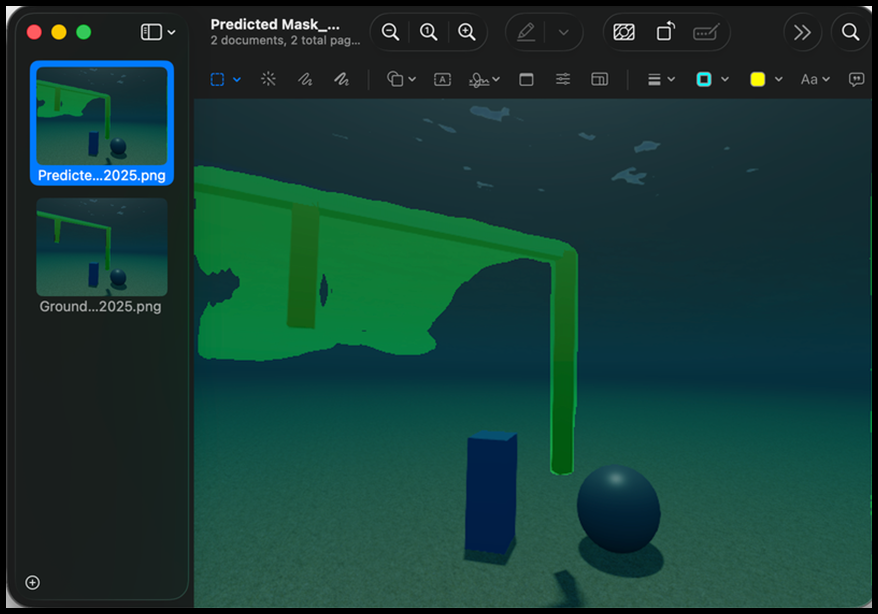 | 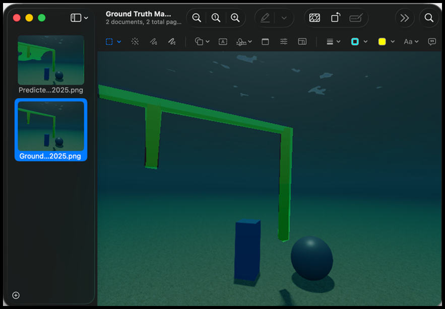 |

### Mapping Update

Researched and evaluated visual SLAM architectures to incorporate mapping into the AUV. After analysis, determined that combining the existing PCL-based detection pipeline with SLAM-based models was the best approach for competition requirements.

<table>
  <tr>
    <td>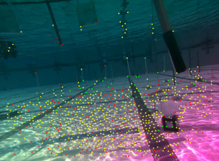</td>
    <td>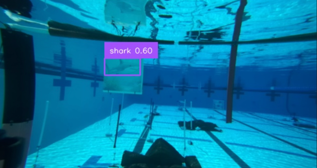</td>
  </tr>
  <tr>
    <td align="center"><em>Point cloud mapping output during pool testing</em></td>
    <td align="center"><em>Live object detection during pool testing</em></td>
  </tr>
</table>

### Skills Demonstrated

- Computer vision and object detection model evaluation and optimization
- Automated testing frameworks for model validation and iterative debugging
- Robotics perception pipeline development (ONNX Runtime, PCL, SLAM)
- ROS2 integration and sensor pipeline debugging

---

## Weather Hazard Tracking Software

A full-stack geospatial application built for Environment Canada's Coastal Prediction Center to store, visualize, and query extreme weather events. The system allows forecasters to be aware of an event's lasting effects and assess compounded risks across western Canada.

Users can create a hazard polygon by entering event details, plotting boundary points on an interactive map, and saving the record to the server for persistent access.

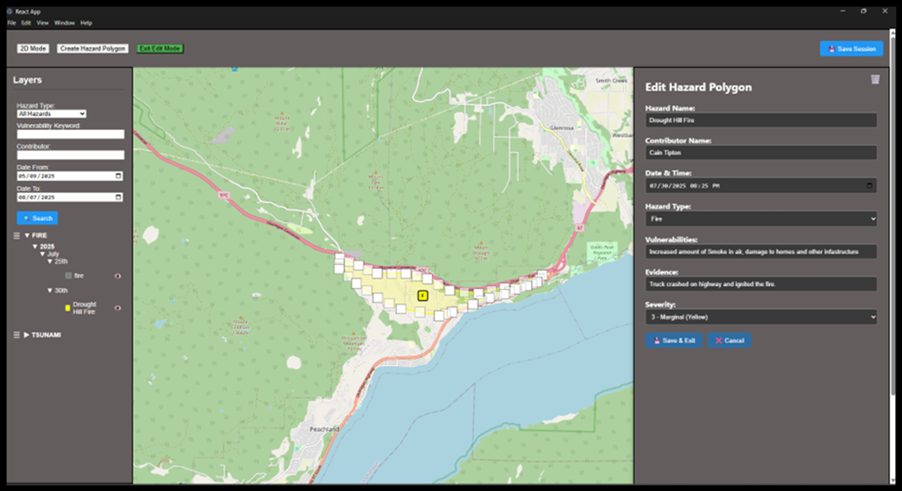

<table>
  <tr>
    <td>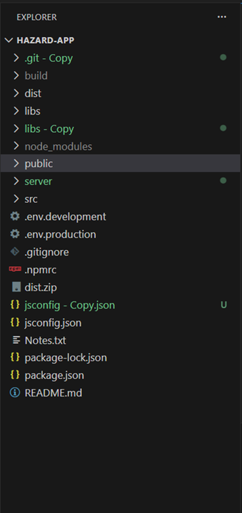</td>
    <td></td>
    <td>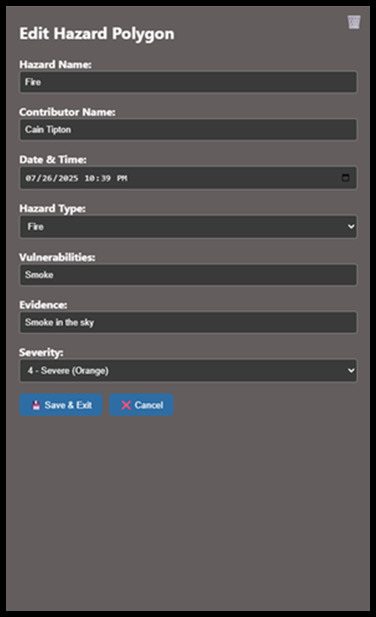</td>
  </tr>
  <tr>
    <td align="center"><em>1. Enter event info</em></td>
    <td align="center"><em>2. Plot on map & edit</em></td>
    <td align="center"><em>3. Save to server</em></td>
  </tr>
</table>

### Skills Demonstrated

- Full-stack development: React frontend with interactive geospatial mapping, Node.js backend with RESTful API architecture
- Database design for storing and retrieving spatial event data
- Translating operational user requirements into a production-deployed application

---

## BS Movie Review Website

A full-stack movie review platform developed as a term-long Software Engineering course project. Built with a FastAPI backend and Next.js frontend, with a focus on clean architecture, automated testing, and containerized deployment.

<table>
  <tr>
    <td>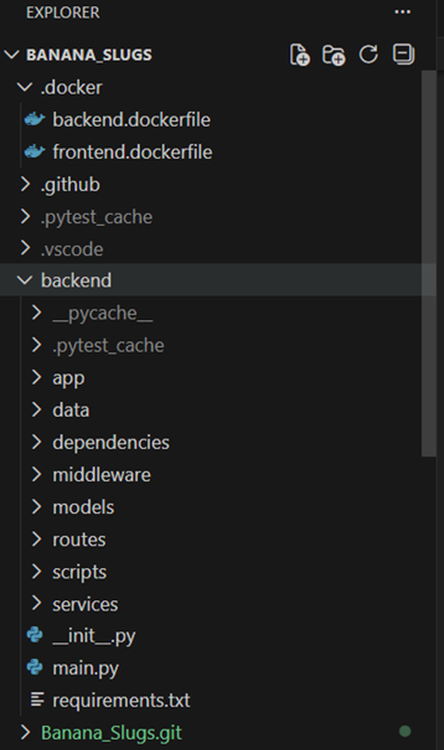</td>
    <td>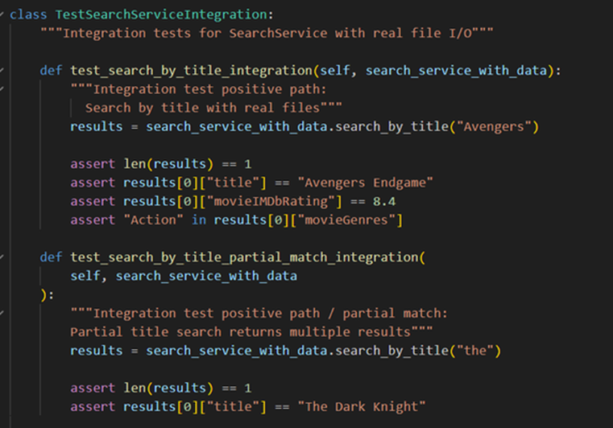</td>
  </tr>
  <tr>
    <td align="center"><em>Backend project architecture</em></td>
    <td align="center"><em>Unit and integration tests for the search algorithm</em></td>
  </tr>
</table>

### Skills Demonstrated

- RESTful API implementation and database design
- Writing clean, modular code with comprehensive documentation
- Automated testing with 93% coverage via Pytest
- Docker containerization for cross-platform deployment

---

## Custom Online Grocery Store

A full-featured e-commerce platform developed for a Database Systems course, modelled after a standard online grocery experience. Built with a Node.js/Express backend and MySQL database, with full ACID-compliant transaction management.

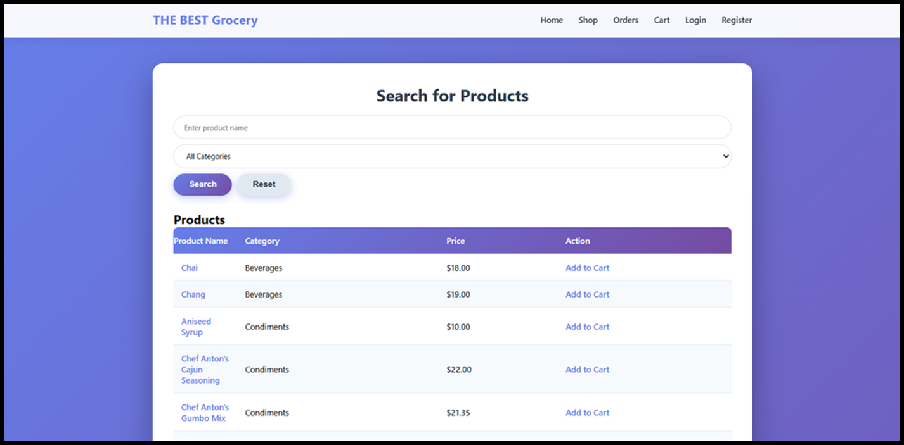

<table>
  <tr>
    <td>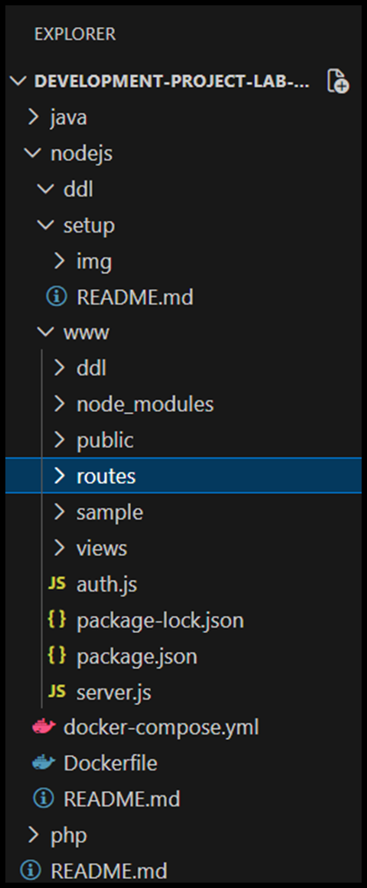</td>
    <td>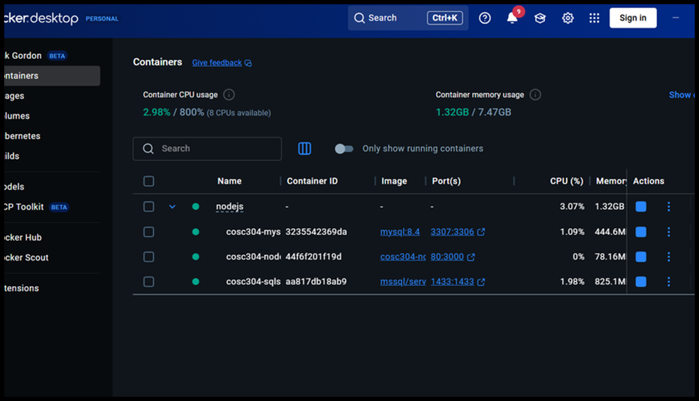</td>
  </tr>
  <tr>
    <td align="center"><em>Application containerized with Docker</em></td>
    <td align="center"><em>Project architecture</em></td>
  </tr>
</table>

**Key features:** user login/signup, shopping cart, admin tools, secure authentication, dynamic product catalog.

### Skills Demonstrated

- MySQL database design with ACID-compliant transaction management
- Secure user authentication and session handling
- Docker containerization and Git version control workflows

---

## Drone Delivery Network Optimization

A comparative spatial analysis examining how delivery mode fundamentally alters optimal hub placement, conducted across two scenarios in San Francisco.

**Ground-based scenario:** Used ArcGIS Pro's Location-Allocation solver with population-weighted census demand data to identify 11 optimal hub locations capturing 70% market share, competing against existing store locations.

**Drone scenario:** Built a multi-criteria cost surface raster combining LiDAR-derived building heights, FAA airspace altitude ceilings, terrain elevation, slope, and power line constraints — weighted and reclassified to a 0–100 cost scale with hard no-fly masks applied post-analysis for FAA 0ft ceiling cells and NPS-restricted zones. Currently applying Least-Cost Path analysis with integrated census income and population density data to identify hub placements that maximize population coverage while minimizing flight cost across the constraint surface.
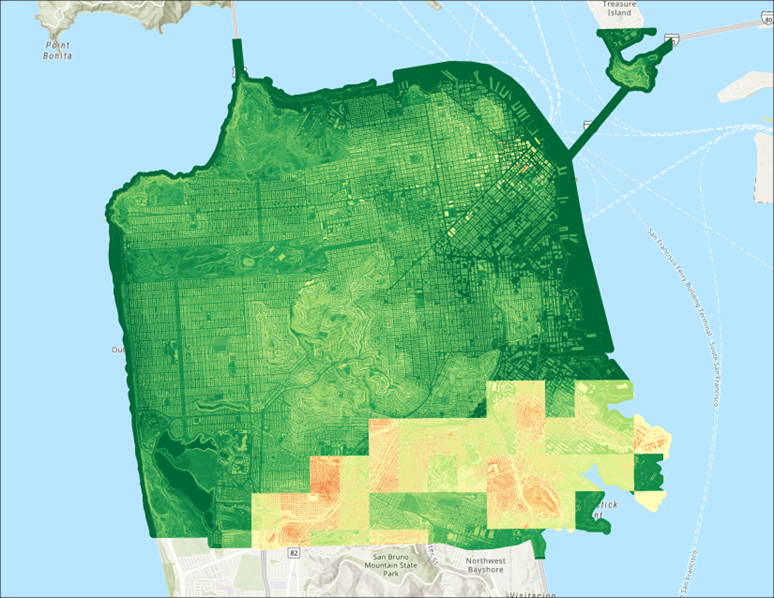
 <em>Weighted sum cost-layer</em>
<table>
  <tr>
    <td>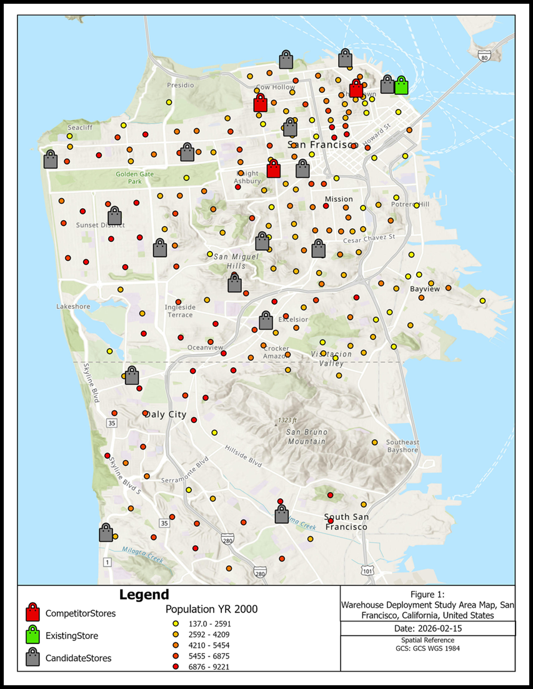</td>
    <td>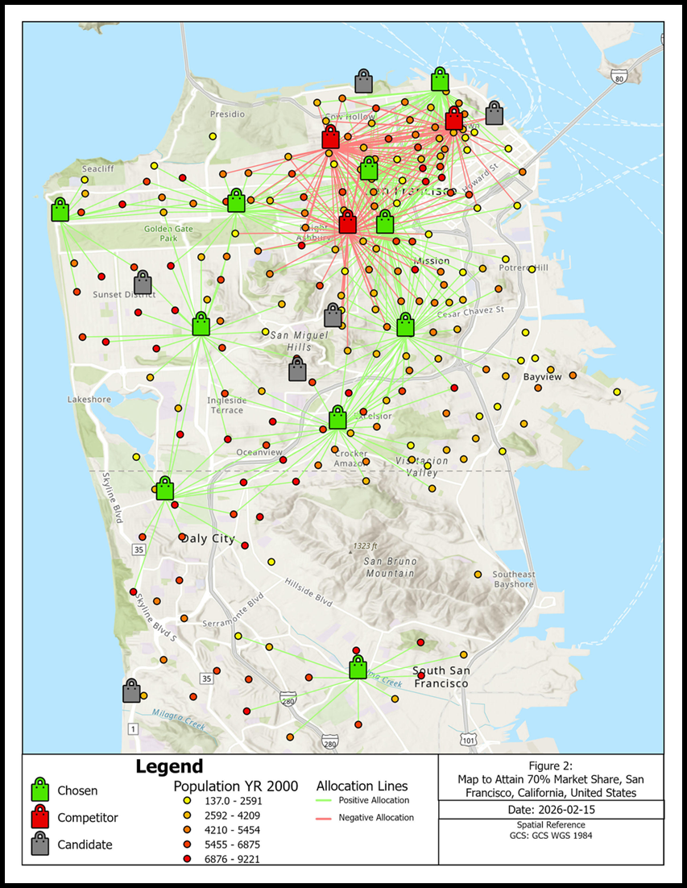</td>
    
  </tr>
  <tr>
    <td align="center"><em>Raw candidate and competitor store data</em></td>
    <td align="center"><em>Optimized hub placements — 70% market share result</em></td>
  </tr>
</table>

### Skills Demonstrated

- Location-Allocation optimization (Maximize Coverage, Minimize Impedance, Maximize Market Share)
- Multi-criteria raster analysis with weighted cost surfaces
- FAA airspace constraint integration as polygon barriers
- Least-Cost Path routing and cost-based spatial search

---

## Animal Overpass Proposal

A spatial analysis identifying optimal locations for a wildlife overpass along Highway 16 in Jasper, Alberta. The goal was to determine routes that facilitate safe animal movement while minimizing conflict with human infrastructure.

Ten input rasters, including land cover, elevation, and human proximity, were reclassified to a common 1–100 resistance scale and combined into a composite surface. Least-Cost Path analysis was then applied using designated habitat patch data to identify optimal crossing corridors.

<table>
  <tr>
    <td>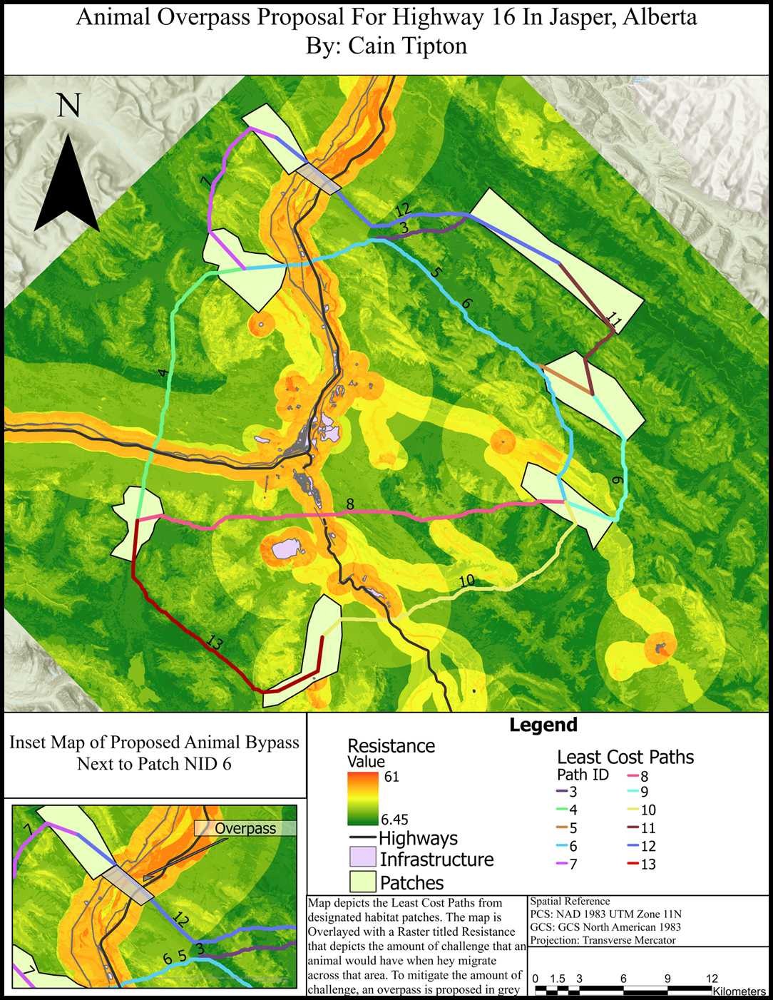</td>
    <td>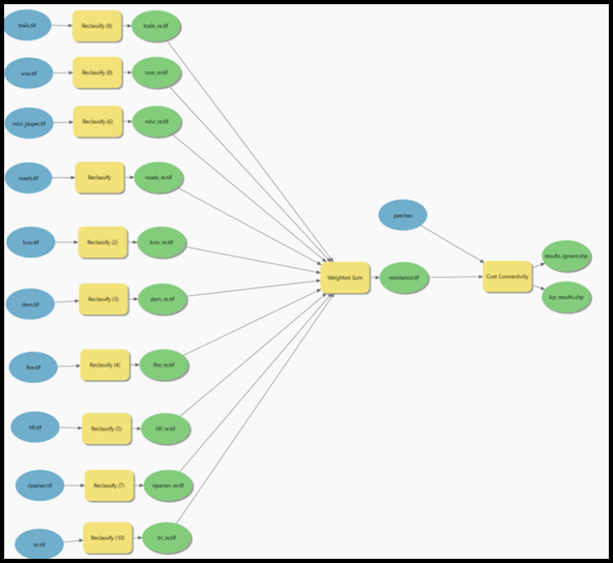</td>
  </tr>
  <tr>
    <td align="center"><em>Resistance surface model used for LCP analysis</em></td>
    <td align="center"><em>Final proposed overpass locations along Highway 16</em></td>
  </tr>
</table>

### Skills Demonstrated

- Multi-criteria evaluation and least-cost path algorithms
- Cost surface construction through rasterization and reclassification
- Large-scale spatial data transformation and processing

---

## Historic Fire Analysis of the Okanagan Valley

A spatial pattern analysis of forest fires in the Okanagan region between 2008 and 2018, comparing human-caused versus lightning-caused ignitions using a range of GIS statistical techniques.

Human-caused fires showed wider spatial clustering than lightning-caused fires, with distinct hotspot patterns and significant positive spatial autocorrelation in lightning fire sizes.

<table>
  <tr>
    <td>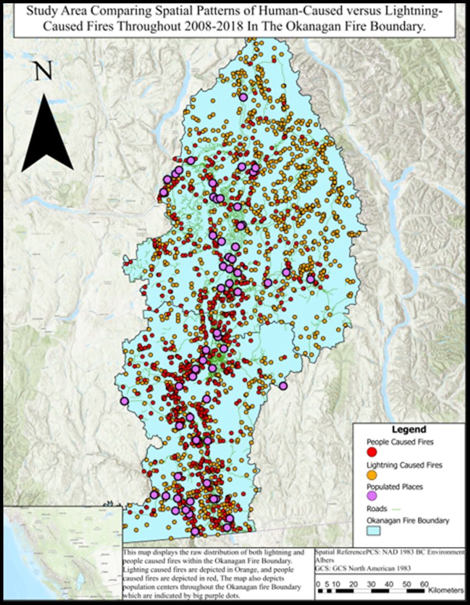</td>
    <td>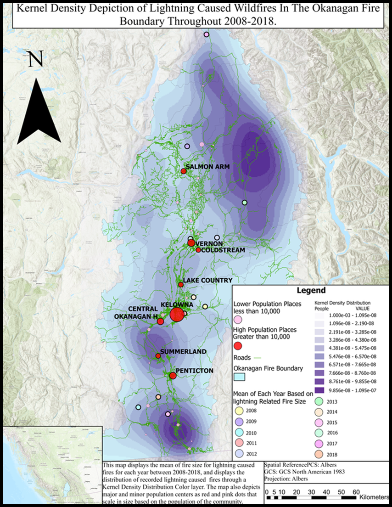</td>
    <td>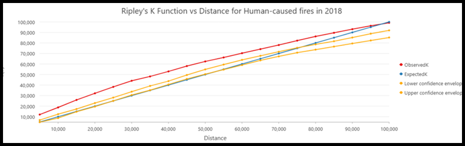</td>
  </tr>
  <tr>
    <td align="center"><em>Raw fire distribution (2008–2018)</em></td>
    <td align="center"><em>Kernel density hotspot map</em></td>
    <td align="center"><em>Ripley's K function — spatial clustering analysis</em></td>
  </tr>
</table>

**Methods:** mean center calculations (weighted and unweighted by fire size), Ripley's K function for spatial clustering, kernel density estimation for hotspot identification, and Moran's Index for global and local spatial autocorrelation.

### Skills Demonstrated

- Point pattern analysis using Ripley's K function
- Kernel density estimation for hotspot identification
- Moran's Index for spatial autocorrelation
- Comparative spatial analysis of categorical data

---

*For questions or to connect, reach out at caintipton2023@gmail.com*
